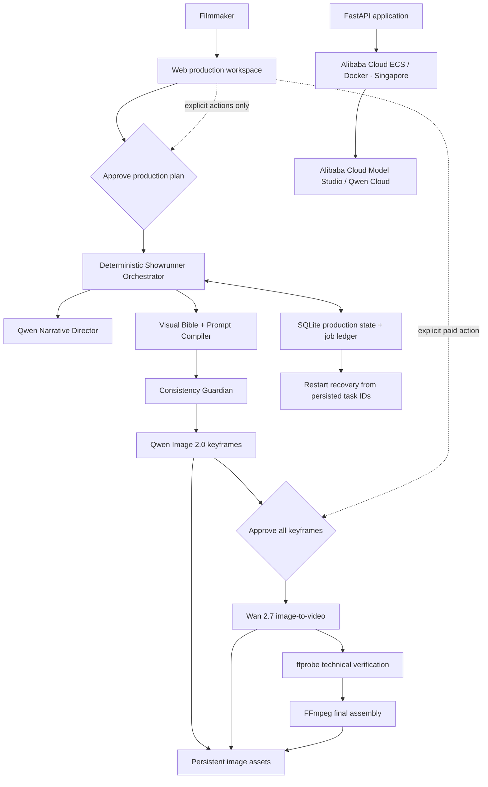

# VideoForge Showrunner

VideoForge is an agentic short-film production workspace built for **Track 2: AI Showrunner** in the Global AI Hackathon Series with Qwen Cloud.

A filmmaker enters one story idea. VideoForge turns it into an editable narrative plan, an immutable character/environment bible, a six-shot storyboard, approved Qwen keyframes, Wan 2.7 animations, and an optional FFmpeg final preview—with every prompt, seed, model, job, retry, cost estimate, and continuity decision recorded.

The core innovation is simple:

> VideoForge converts open-ended video generation into a constrained, inspectable film-production workflow. It freezes identity, set design, lighting, and camera language in approved storyboard images before asking Wan to generate motion.


## The problem

Independent text-to-video calls repeatedly reinterpret the actor, wardrobe, set, prop, palette, and lens language. More prompting does not create a shared visual memory; it creates six separate guesses.

VideoForge treats Qwen Cloud as a showrunner, not a clip vending machine:

1. Qwen plans a story achievable in six visual beats.
2. A Visual Director writes one immutable bible.
3. A Prompt Compiler injects that exact bible into every image prompt.
4. The user approves all six Qwen storyboard images.
5. Wan receives each approved image as its first frame plus a motion-only prompt.
6. FFmpeg normalizes and assembles the verified clips without hiding individual outputs.

The original successful six-call experiment remains intact in [`qwen_multishot_test.py`](qwen_multishot_test.py). The production provider reuses its raw HTTP client, retry policy, region handling, downloads, and validated Qwen/Wan request protocol in [`videoforge/providers/qwen_cloud.py`](videoforge/providers/qwen_cloud.py).

## Main features

- Five-stage workspace: **Concept → Plan → Storyboard → Production → Final Cut**
- Editable story, visual bible, six-beat shot plan, image deltas, motion, durations, and seeds
- Byte-identical shared-bible reuse across compiled image prompts
- Structured Pydantic validation before any media request
- Human approval gates before image and video generation
- Qwen Image 2.0 keyframes and Wan 2.7 image-to-video clips
- Mock provider that runs the entire UI with local sample media and simulated async states
- SQLite persistence for projects, plans, shots, assets, jobs, requests, and consistency reports
- Restart recovery from persisted Wan task IDs
- Explicit per-shot retries with a hard retry ceiling
- H.264, 720P, 30 fps, and duration checks through `ffprobe`
- Optional FFmpeg final preview; individual shots survive assembly failure
- Visible budget estimate and clear paid-call labels
- Docker image and documented Alibaba Cloud ECS deployment path

## Architecture



See [`docs/architecture.md`](docs/architecture.md) for the state machine, entities, provider boundary, and recovery rules.

## Qwen Cloud models

| Stage | Default model | Control strategy |
|---|---|---|
| Structured planning | `qwen-plus` | JSON-only plan validated with Pydantic |
| Optional visual inspection | `qwen3-vl-plus` | Scores and differences are shown, never auto-regenerated |
| Storyboard keyframes | `qwen-image-2.0` | `prompt_extend=false`, one image, fixed 16:9 size, recorded seed |
| Shot animation | `wan2.7-i2v` | Approved first frame, motion-only prompt, 720P, 2–5 seconds, recorded seed |

Model names are environment variables. API keys remain server-side and are never returned by `/api/config`.

## Local setup

Requirements: Python 3.11+, FFmpeg/ffprobe, and optionally Node/npm for the convenience scripts and Playwright verification.

```bash
python3 -m venv .venv
source .venv/bin/activate
pip install -r requirements-dev.txt
cp .env.example .env
npm start
```

Open [http://127.0.0.1:8000](http://127.0.0.1:8000).

### Production Qwen Cloud mode — default

```dotenv
SHOWRUNNER_PROVIDER=qwen
QWEN_API_KEY=your-server-side-key
QWEN_WORKSPACE_ID=your-workspace-id
QWEN_REGION=ap-southeast-1
```

Compatibility aliases `DASHSCOPE_API_KEY`, `QWEN_CLOUD_API_KEY`, and `QWEN_CLOUD_BASE_URL` are also accepted. Storyboard and video endpoints reject requests unless the browser explicitly sends `confirmPaidCalls=true` after a user action.

The paid smoke script refuses to run without an explicit flag:

```bash
npm run smoke:paid -- --confirm-paid-calls
```

That command intentionally creates one real plan, one paid image, and one paid three-second video. Normal tests never call Qwen Cloud.

### Test-only mock provider

```dotenv
SHOWRUNNER_PROVIDER=mock
```

The mock provider remains available for isolated automated verification, but the production browser refuses to present it as a runnable submission mode. Run its complete headless smoke test with:

```bash
npm run smoke:mock
```

## Demo

For an instant presentation, click **Open recorded Qwen demo** on the Concept screen. It loads five winning Qwen frames, one deterministic matching-cut crop derived from Shot 01's accepted ending frame, the visual bible, shot plan, prompts, seeds, retries, six paid Wan 2.7 image-to-video outputs, and their 30-second assembled preview. Replaying the recorded route itself makes no new provider call and opens at Storyboard Review with every stage available.

> A woman enters her room in the dark and sees a shadow moving independently.

The sequence moves from a wide room master to her eyeline, an actor-free shadow detail, a tight TV over-shoulder, a reaction close-up, and a final reflection insert. The order is story-driven rather than a fixed shot-size template. To demonstrate the fully live path instead, enter a new prompt and click **Generate production plan**; paid media remains behind explicit confirmation.

Follow [`docs/demo-script.md`](docs/demo-script.md) for a three-minute hackathon presentation.

## Budget and safety controls

Defaults:

```dotenv
MAX_SHOTS=6
DEFAULT_SHOTS=6
MAX_VIDEO_DURATION_SECONDS=5
MAX_PROJECT_RETRIES=4
MAX_CONCURRENT_IMAGE_TASKS=1
MAX_CONCURRENT_VIDEO_TASKS=2
```

The interface calculates planned image calls, video calls, total video seconds, resolution, and an estimated CNY cost. Estimates can be updated through pricing environment variables. Provider billing remains authoritative.

Automatic retries are limited to the proven HTTP client's transient transport handling. Creative retries require the user. Authentication, validation, moderation, and incorrect-model failures are not retried as transport errors.

## Persistence and recovery

SQLite stores the full production state in `data/videoforge.db`; generated assets live under `data/assets/`. A browser refresh simply reloads this state and resumes polling.

On a server restart:

- queued generation jobs resume;
- Wan polling resumes when a remote task ID was persisted;
- interrupted real synchronous image calls are marked for explicit user retry, preventing accidental duplicate billing;
- individual assets remain available even if another shot or final assembly fails.

Production runs one application worker because the local job executor is process-scoped. A multi-instance deployment would move the same persisted job protocol to a distributed queue.

## API overview

| Route | Purpose |
|---|---|
| `POST /api/recorded-demo` | Load the completed six-shot Qwen rehearsal without provider calls |
| `POST /api/projects` | Create a draft |
| `POST /api/projects/:id/plan` | Create a structured plan |
| `PATCH /api/projects/:id/plan` | Validate, repair, and save edits |
| `POST /api/projects/:id/plan/approve` | Record approval gate 1 |
| `POST /api/projects/:id/storyboard` | Explicit image-generation action |
| `POST /api/shots/:id/image/approve` | Approve a keyframe |
| `POST /api/projects/:id/videos` | Explicit video-generation action |
| `POST /api/shots/:id/video/retry` | Retry one failed clip |
| `POST /api/projects/:id/consistency-check` | Inspect storyboard without regeneration |
| `POST /api/projects/:id/assemble` | Normalize and concatenate clips |
| `GET /api/projects/:id/jobs` | Poll persistent progress |
| `GET /api/health` | Container health check |

Interactive API documentation is available at `/docs` while the server is running.

## Tests

```bash
pytest
# or
npm test
```

The suite covers schemas, prompt compilation, immutable-bible reuse, shot order, seeds, hashes, retry classification, budgets, state transitions, provider payloads without calls, mock workflows, partial failures, independent retry, paid confirmation, refresh persistence, and FFmpeg assembly failure.

## Alibaba Cloud deployment

The prepared target is **Alibaba Cloud ECS with Docker in Singapore**, keeping application compute, static data, Model Studio endpoint, and API key region aligned. Mount persistent storage at `/app/data` and use `/api/health` for health checks.

See [`docs/deployment.md`](docs/deployment.md) for build, environment, volume, start, and recovery instructions. This repository provides a deployable artifact and a clearly identifiable Qwen Cloud code path; it does **not** claim that a live Alibaba service has been deployed when one has not.

## Known limitations

- Prompt-only multi-image identity is good but not pixel-identical; jewelry and fine facial details can drift.
- The current editor is a focused six-shot workspace, not a nonlinear timeline.
- Final assembly is a reliable straight cut with normalization; elaborate transitions and sound design are intentionally out of scope.
- Local SQLite/assets suit one-instance hackathon deployment. Horizontal scale needs managed SQL, object storage, and a distributed worker queue.
- Remote provider URLs expire; VideoForge downloads assets immediately, but a stale real keyframe URL requires keyframe regeneration before animation.

## License

[MIT](LICENSE)
