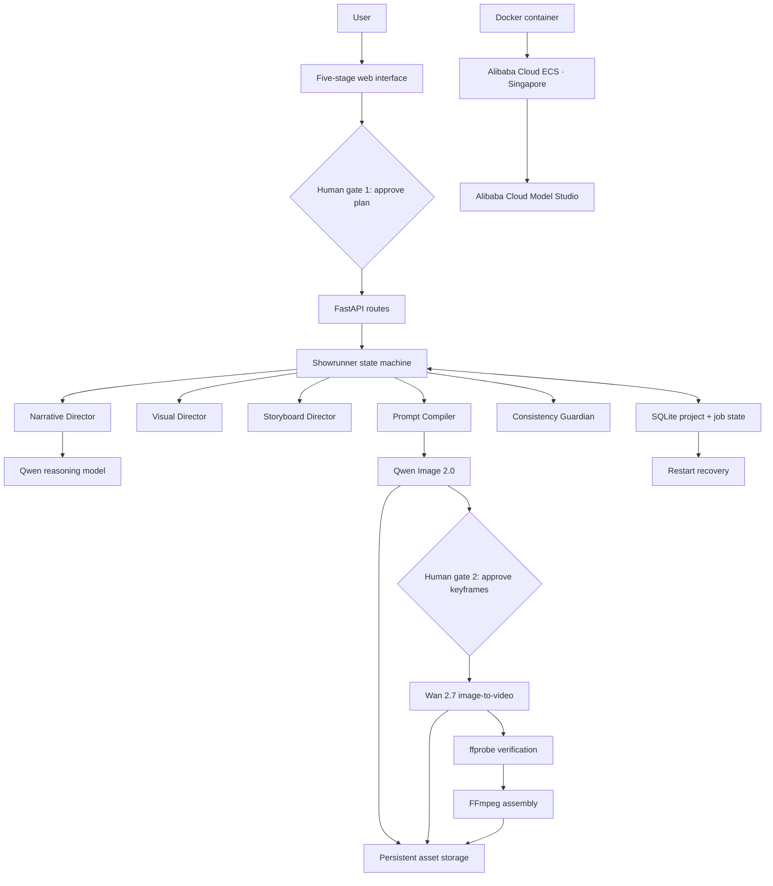
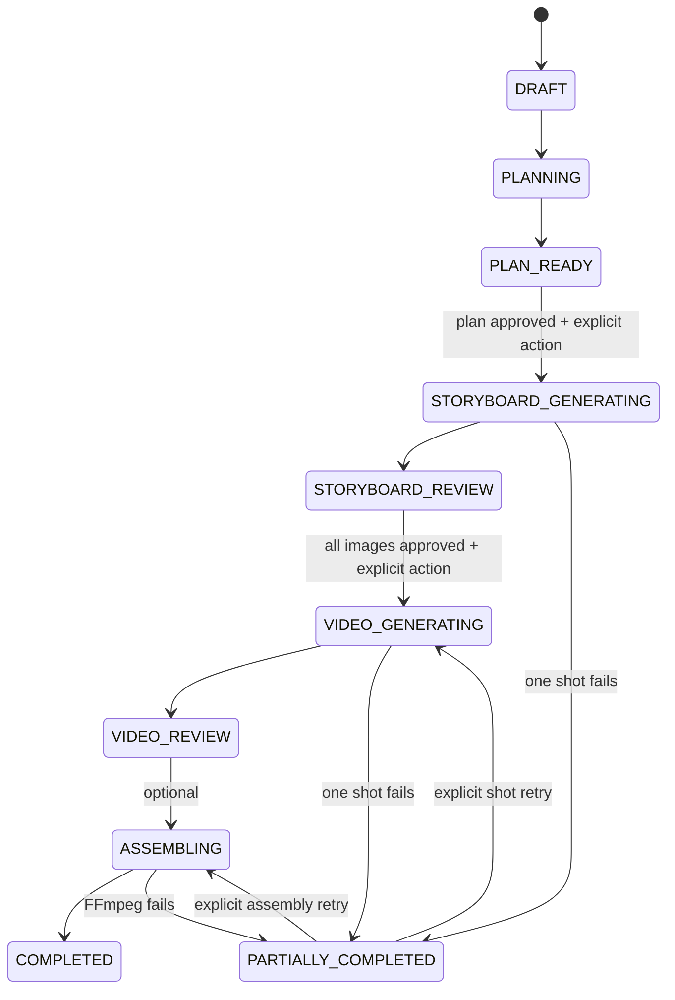

# Architecture

VideoForge uses one deterministic orchestrator with modular internal directors. It is deliberately not a swarm of conversational agents.

## State machine

Transitions are declared in `videoforge/state_machine.py`; route handlers and background workers cannot skip approval gates.

## Modules

| Module | Responsibility |
|---|---|
| `schemas.py` | Pydantic domain contracts and limits |
| `planner.py` | Three-beat narrative, bible, shots, deterministic seeds |
| `prompting.py` | Immutable image-prefix and motion-only prompt compilation |
| `consistency.py` | Structured preflight warnings and repair |
| `providers/` | Mock/Qwen boundary and request construction |
| `db.py` | SQLite entities and aggregate project reads |
| `jobs.py` | Persistent async image/video/assembly execution |
| `assembly.py` | FFmpeg normalization, concat, and ffprobe checks |
| `app.py` | API, approval gates, paid confirmations, static UI |

## Persistence model

Required entities map directly to SQLite tables:

- `projects`
- `production_plans`
- `shots`
- `assets`
- `generation_jobs`
- `provider_requests`
- `consistency_reports`

Jobs record model, exact prompt, SHA-256 prompt hash, negative prompt, seed, parameters, request ID, remote task ID, retry count, error, timing, URLs, estimated cost, and provider usage. API keys are never stored.

## Provider boundary

`ShowrunnerProvider` defines planning, visual inspection, image creation, video submission, task polling, and downloads. `QwenCloudProvider` wraps the previously proven `ModelStudioClient` instead of scattering API calls through routes. `MockShowrunnerProvider` uses the same orchestration contract.

## Recovery

Queued jobs are discovered at startup. Persisted Wan task IDs resume polling after a restart. A real synchronous image request interrupted before its response has no safe provider task handle; VideoForge marks it failed and asks the user to retry explicitly, avoiding a hidden duplicate charge.

